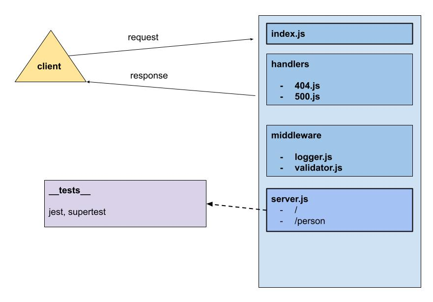

# LAB - Class 02

## Project: Basic Express Server

### Author: Kenny W. Lino

### Problem Domain  

This application servers as an example for how to create and deploy a server with our own custom middleware and handlers.

### Links and Resources

- [ci/cd](https://github.com/kennywlino/basic-express-server/actions)
- [back-end server (production)](https://basic-express-server-iwa6.onrender.com)
- [Main PR from dev](https://github.com/kennywlino/basic-express-server/pull/1)
- [Corrections from dev](https://github.com/kennywlino/basic-express-server/pull/4)

### Setup

#### `.env` requirements (where applicable)

i.e.

- `PORT` - Port Number

#### How to initialize/run your application

- nodemon

#### How to use your library (where applicable)

#### Features / Routes

- GET : `/` - default route to hit
- GET: `/person` - route for getting person name

**Middleware**

- logger.js - logs the method and path
- validator.js - validates whether a name has been passed to the /person route

**Handlers**

- 404.js -- handles 404 errors
- 500.js -- handles 500 errors

#### Tests

- How do you run tests?
  - npm test

- Any tests of note?
  - 404 on a bad route
  - 404 on a bad method
  - 500 if no name in the query string
  - 200 if the name is in the query string
  - given a name in the query string, the output object is correct

#### UML

